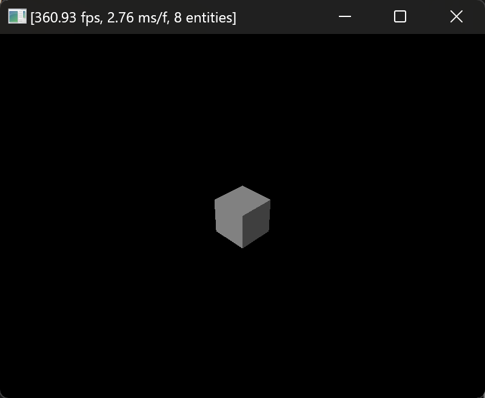

# Hello World with Ambient
## 1. [Install Ambient](https://ambientrun.github.io/Ambient/user/installing.html) (<--Url)
## 2. Create hello-world Ambient program:
```PowerShell
ambient new hello_cube
cd hello_cube
ambient run
```

## 3. Edit src/lib.rs and replace 'quad' with 'cube' in 2 places.
```PowerShell
ambient run
```

## 4. Add some color with this line on the 2nd Entity:
```Rust
    .with(color(), random::<Vec3>().extend(1.0))
```

**Troubleshooting:** In the code below, `color()` has red squigglies under it. That is Visual Studio Code's Rust-Analyzer add-in letting me know I have a compile error. I will also get this compile error if I attempt to 'ambient run'.  Instead, I will fix it by choosing `Quick Fix...`

  

And this is the fix:

  

Which will be added to the already complicated/nested `use` statement at the top of `lib.rs`:  

  

And now your cube will now be colorful!
```PowerShell
ambient run
```


**Troubleshooting:** Is your cube still white?  You must add the random color() to the _second Entity_.  The first Entity is the camera, which is invisible.  Perhaps it is now colorful _and_ invisible?  